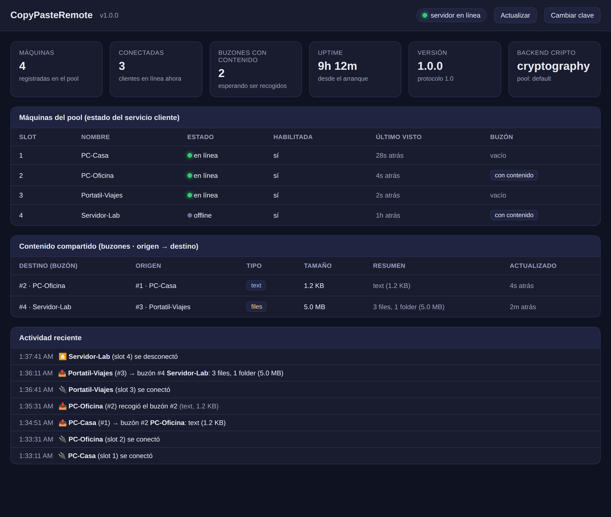

# CopyPasteRemote

**Portapapeles compartido entre ordenadores en redes distintas.** Copia en una
máquina y pega en otra —texto, archivos y carpetas— estén donde estén, con solo
salida a Internet hacia un servidor central que actúa de *director de orquesta*.

```
Máquina 1  ──Ctrl+Alt+2──►  [ Buzón 2 ]  ◄──Ctrl+Shift+2──  Máquina 2
 (copiar)      enviar         servidor          pegar         (pegar)
```

- 🔐 **Cifrado de extremo a extremo** (AES-256-GCM); el servidor solo ve datos cifrados.
- 📁 **Texto, archivos y carpetas** con su estructura, como el copiar/pegar nativo.
- 🌐 **Sin VPN**: los clientes solo necesitan HTTPS hacia el servidor.
- ⌨️ **Atajos globales** configurables + icono de **bandeja**.
- 🪟 **Compatible con Windows 7/10/11 y Server 2016/2022** (cliente en Python 3.8).
- 🧩 **Alta previa de máquinas** en un *pool* gestionado por el servidor.
- 📊 **Dashboard de administración** en `/dashboard`: quién se conecta, qué se
  comparte (origen → destino) y estado de los servicios.
- ⚙️ **Auto-arranque como servicio de Windows** (servidor) y servicio lanzador o
  tarea al iniciar sesión (cliente).

> El proyecto vive en la subcarpeta **`copypasteremote/`** del repositorio; ejecuta
> los comandos desde ahí.

## Documentación

| Documento | Contenido |
|-----------|-----------|
| [docs/SPECIFICATION.md](docs/SPECIFICATION.md) | Especificaciones técnicas del proyecto. |
| [docs/IMPLEMENTATION_PLAN.md](docs/IMPLEMENTATION_PLAN.md) | Plan de implementación. |
| [docs/ARCHITECTURE.md](docs/ARCHITECTURE.md) | Arquitectura, diagramas y topología (DD-WRT/ESXi). |
| [docs/INSTALL.md](docs/INSTALL.md) | **Manual de instalación** (servidor y cliente). |
| [docs/USER_GUIDE.md](docs/USER_GUIDE.md) | **Manual de uso**. |
| [docs/SECURITY.md](docs/SECURITY.md) | **Análisis de seguridad** y checklist de endurecimiento. |

## Inicio rápido

### Servidor (VM del cloud privado)

```bash
python3 -m venv .venv && . .venv/bin/activate
pip install -r requirements-server.txt
python -m cpr_server.admin_cli --config server-config.json init \
    --public-url https://TU_IP_PUBLICA:8765
python -m cpr_server.admin_cli --config server-config.json add-machine \
    --slot 1 --name "PC-Casa" --client-config clients/pc-casa.json
python -m cpr_server.admin_cli --config server-config.json add-machine \
    --slot 2 --name "PC-Oficina" --client-config clients/pc-oficina.json
CPR_SERVER_CONFIG=server-config.json python run_server.py
```

Reenvía el puerto `8765/tcp` en el DD-WRT a la VM y configura TLS (ver INSTALL.md).

### Cliente (cada Windows)

```powershell
pip install -r requirements-client.txt
# copia el config.json generado a %APPDATA%\CopyPasteRemote\config.json
python run_client.py --check     # verifica conexión
python run_client.py             # app de bandeja con atajos globales
```

Atajos por defecto: **`Ctrl+Alt+N`** envía al buzón N · **`Ctrl+Shift+N`** pega del
buzón N · **`Ctrl+Alt+V`** pega de tu buzón.

### Dashboard

Abre **`https://TU_IP_PUBLICA:8765/dashboard`** e introduce la `admin_api_key`
(`admin_cli show-admin-key`). Verás máquinas conectadas, contenido compartido
(origen → destino) y actividad en tiempo real. Detalles en
[docs/INSTALL.md](docs/INSTALL.md) (Parte D).



## Estructura

```
cpr_shared/   Librería común (cripto + protocolo)
cpr_server/   Orquestador (FastAPI: REST + WebSocket, SQLite, dashboard, CLI admin, servicio Windows)
cpr_client/   Agente Windows (portapapeles, atajos, bandeja, transporte, servicio Windows)
scripts/      Despliegue (systemd, Docker, servicio Windows, tarea programada, build .exe)
docs/         Especificación, plan, arquitectura y manuales
tests/        Pruebas unitarias e integración E2E
```
 
## Desarrollo y pruebas

```bash
python3 -m venv .venv && . .venv/bin/activate
pip install -r requirements-server.txt requests httpx websocket-client pytest
pytest -q
```

El núcleo (cripto, protocolo, empaquetado, servidor y agente) se prueba en cualquier
SO con un backend de portapapeles simulado; solo el acceso real a Win32 requiere
Windows.

## Seguridad

TLS en tránsito, autenticación por token y por máquina, cifrado del contenido con
clave de pool, verificación de integridad SHA-256 y expiración automática de los
buzones. Ver [docs/SPECIFICATION.md](docs/SPECIFICATION.md) §10 y
[docs/ARCHITECTURE.md](docs/ARCHITECTURE.md) §7.

## Licencia

MIT. Ver [LICENSE](LICENSE).
